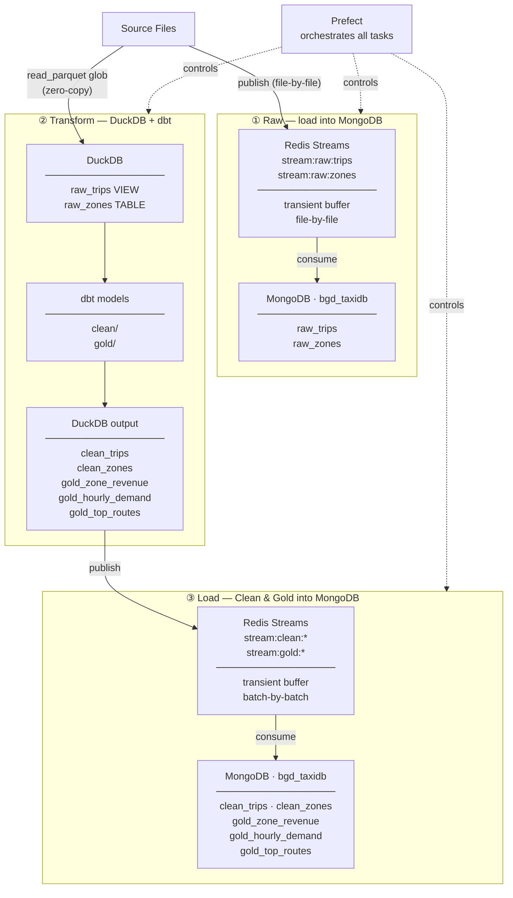

# NYC Taxi ETL — Architecture

24 monthly NYC Yellow Taxi parquet files (2022-2023, ~1.2 GB) processed through
a Medallion Architecture (Raw → Clean → Gold).

| Component | Technology |
| --------- | ---------- |
| Orchestration | [Prefect 3](https://docs.prefect.io/) — tasks, retries, logging |
| Message Queue | [Redis Streams](https://redis.io/docs/data-types/streams/) — decouples data ingestion from storage |
| Transformations | [dbt](https://docs.getdbt.com/) + [DuckDB](https://duckdb.org/) — SQL models over parquet |
| Storage | MongoDB — all three layers |

---

## Pipeline Flow

---

## Idempotency

| Collection / Layer | Strategy |
| ------------------ | -------- |
| `raw_trips`, `raw_zones` | Skipped if populated (`--force` to reload) |
| dbt models (DuckDB) | Skipped if all five tables exist; `--force` → `dbt run --full-refresh` |
| `clean_trips` (MongoDB) | Skipped if populated; `--force` → delete_many + re-insert (indexes preserved) |
| `clean_zones` | Upsert by `LocationID` |
| `gold_zone_revenue` | Upsert by `location_id` |
| `gold_hourly_demand` | Upsert by `pickup_hour` |
| `gold_top_routes` | Upsert by `(pu_location_id, do_location_id)` |
| `pipeline_runs` | Append-only |
